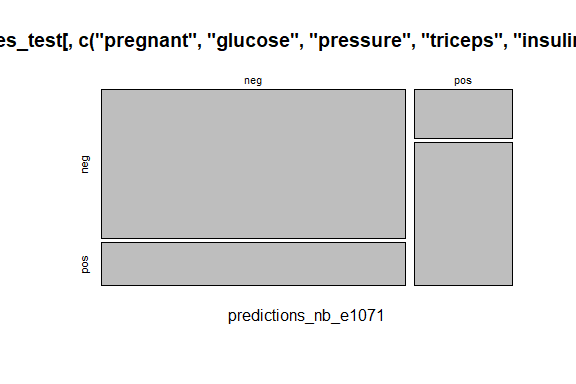
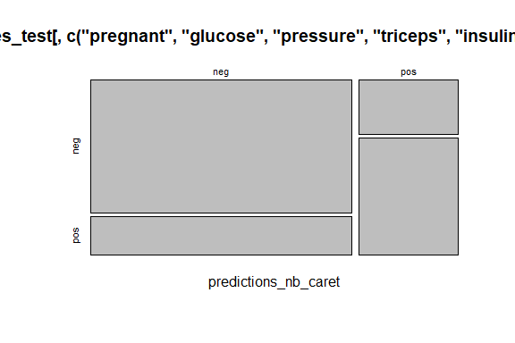

Business Intelligence Lab Submission Markdown
================
naive
4/10/2023

- [Student Details](#student-details)
- [Setup Chunk](#setup-chunk)
- [DATASET 1 (Splitting the dataset): PimaIndians
  Diabetes](#dataset-1-splitting-the-dataset-pimaindians-diabetes)
  - [3.b. Test the trained caret Naive Bayes model using the testing
    dataset
    —-](#3b-test-the-trained-caret-naive-bayes-model-using-the-testing-dataset--)
  - [4. View the Results —-](#4-view-the-results--)
    - [4.a. e1071 Naive Bayes model and test results using a confusion
      matrix
      —-](#4a-e1071-naive-bayes-model-and-test-results-using-a-confusion-matrix--)

# Student Details

|                                                   |                                                                                                                                                                                                                                                                                                                                                             |     |
|---------------------------------------------------|-------------------------------------------------------------------------------------------------------------------------------------------------------------------------------------------------------------------------------------------------------------------------------------------------------------------------------------------------------------|-----|
| **Student ID Numbers and Names of Group Members** | *\<list one student name, class group (just the letter; A, B, or C), and ID per line, e.g., 123456 - A - John Leposo; you should be between 2 and 5 members per group\>* \| \| 1. 135575 - B - Dennis Nzioki. \| \| 2. 134645 - B - Vivean Lydiah \| \| 3. 134765 - B - Nicholas Munene \| 4. 131653- B - Terry Joan \| \| 5. 124428 - B - Eston Gichuhi \| |     |
| **GitHub Classroom Group Name**                   | *\<specify the name of the team you created on GitHub classroom\>*                                                                                                                                                                                                                                                                                          |     |
| **Course Code**                                   | BBT4206                                                                                                                                                                                                                                                                                                                                                     |     |
| **Course Name**                                   | Business Intelligence II                                                                                                                                                                                                                                                                                                                                    |     |
| **Program**                                       | Bachelor of Business Information Technology                                                                                                                                                                                                                                                                                                                 |     |
| **Semester Duration**                             | 21<sup>st</sup> August 2023 to 28<sup>th</sup> November 2023                                                                                                                                                                                                                                                                                                |     |

# Setup Chunk

We start by installing all the required packages We start by installing
all the required packages

``` r
## formatR - Required to format R code in the markdown ----
if (!is.element("formatR", installed.packages()[, 1])) {
  install.packages("formatR", dependencies = TRUE,
                   repos="https://cloud.r-project.org")
}
require("formatR")
if (require("caret")) {
  require("caret")
} else {
  install.packages("caret", dependencies = TRUE,
                   repos = "https://cloud.r-project.org")
}

## klaR ----
if (require("klaR")) {
  require("klaR")
} else {
  install.packages("klaR", dependencies = TRUE,
                   repos = "https://cloud.r-project.org")
}

## e1071 ----
if (require("e1071")) {
  require("e1071")
} else {
  install.packages("e1071", dependencies = TRUE,
                   repos = "https://cloud.r-project.org")
}

## readr ----
if (require("readr")) {
  require("readr")
} else {
  install.packages("readr", dependencies = TRUE,
                   repos = "https://cloud.r-project.org")
}

## LiblineaR ----
if (require("LiblineaR")) {
  require("LiblineaR")
} else {
  install.packages("LiblineaR", dependencies = TRUE,
                   repos = "https://cloud.r-project.org")
}

## naivebayes ----
if (require("naivebayes")) {
  require("naivebayes")
} else {
  install.packages("naivebayes", dependencies = TRUE,
                   repos = "https://cloud.r-project.org")
     install.packages("mlbench", dependencies = TRUE)  #nolint
  
}
if (!is.element("mlbench", installed.packages()[, 1])) {}
  require("mlbench") #nolint
```

------------------------------------------------------------------------

**Note:** the following “*KnitR*” options have been set as the defaults
in this markdown:  
`knitr::opts_chunk$set(echo = TRUE, warning = FALSE, eval = TRUE, collapse = FALSE, tidy.opts = list(width.cutoff = 80), tidy = TRUE)`.

More KnitR options are documented here
<https://bookdown.org/yihui/rmarkdown-cookbook/chunk-options.html> and
here <https://yihui.org/knitr/options/>.

``` r
knitr::opts_chunk$set(
    eval = TRUE,
    echo = TRUE,
    warning = FALSE,
    collapse = FALSE,
    tidy = TRUE
)
```

# DATASET 1 (Splitting the dataset): PimaIndians Diabetes

``` r
data("PimaIndiansDiabetes")
summary(PimaIndiansDiabetes)
```

    ##     pregnant         glucose         pressure         triceps     
    ##  Min.   : 0.000   Min.   :  0.0   Min.   :  0.00   Min.   : 0.00  
    ##  1st Qu.: 1.000   1st Qu.: 99.0   1st Qu.: 62.00   1st Qu.: 0.00  
    ##  Median : 3.000   Median :117.0   Median : 72.00   Median :23.00  
    ##  Mean   : 3.845   Mean   :120.9   Mean   : 69.11   Mean   :20.54  
    ##  3rd Qu.: 6.000   3rd Qu.:140.2   3rd Qu.: 80.00   3rd Qu.:32.00  
    ##  Max.   :17.000   Max.   :199.0   Max.   :122.00   Max.   :99.00  
    ##     insulin           mass          pedigree           age        diabetes 
    ##  Min.   :  0.0   Min.   : 0.00   Min.   :0.0780   Min.   :21.00   neg:500  
    ##  1st Qu.:  0.0   1st Qu.:27.30   1st Qu.:0.2437   1st Qu.:24.00   pos:268  
    ##  Median : 30.5   Median :32.00   Median :0.3725   Median :29.00            
    ##  Mean   : 79.8   Mean   :31.99   Mean   :0.4719   Mean   :33.24            
    ##  3rd Qu.:127.2   3rd Qu.:36.60   3rd Qu.:0.6262   3rd Qu.:41.00            
    ##  Max.   :846.0   Max.   :67.10   Max.   :2.4200   Max.   :81.00

``` r
str(PimaIndiansDiabetes)
```

    ## 'data.frame':    768 obs. of  9 variables:
    ##  $ pregnant: num  6 1 8 1 0 5 3 10 2 8 ...
    ##  $ glucose : num  148 85 183 89 137 116 78 115 197 125 ...
    ##  $ pressure: num  72 66 64 66 40 74 50 0 70 96 ...
    ##  $ triceps : num  35 29 0 23 35 0 32 0 45 0 ...
    ##  $ insulin : num  0 0 0 94 168 0 88 0 543 0 ...
    ##  $ mass    : num  33.6 26.6 23.3 28.1 43.1 25.6 31 35.3 30.5 0 ...
    ##  $ pedigree: num  0.627 0.351 0.672 0.167 2.288 ...
    ##  $ age     : num  50 31 32 21 33 30 26 29 53 54 ...
    ##  $ diabetes: Factor w/ 2 levels "neg","pos": 2 1 2 1 2 1 2 1 2 2 ...

\##Split the dataset:

``` r
train_index <- createDataPartition(PimaIndiansDiabetes$diabetes, p = 0.75, list = FALSE)
PimaIndiansDiabetes_train <- PimaIndiansDiabetes[train_index, ]
PimaIndiansDiabetes_test <- PimaIndiansDiabetes[-train_index, ]
```

\##Train a Naive Bayes classifier using the training dataset this can be
done by using an naive bayes function in the e1071 package or the caret
package

``` r
PimaIndiansDiabetes_model_nb_e1071 <- # nolint
  e1071::naiveBayes(diabetes ~ pregnant + glucose + pressure + triceps + insulin + mass +
                      pedigree + age,
                    data = PimaIndiansDiabetes_train)
PimaIndiansDiabetes_model_nb_caret <- # nolint
  caret::train(diabetes ~ ., data =
                 PimaIndiansDiabetes_train[, c("pregnant", "glucose", "pressure", "triceps", "insulin",
                                               "mass", "pedigree", "age", "diabetes")],
               method = "naive_bayes")
```

\##Test the trained model using the testing dataset \### 3.a. Test the
trained e1071 Naive Bayes model using the testing dataset —-

``` r
predictions_nb_e1071 <- predict(PimaIndiansDiabetes_model_nb_e1071, PimaIndiansDiabetes_test[,
    c("pregnant", "glucose", "pressure", "triceps", "insulin", "mass", "pedigree",
        "age", "diabetes")])
```

### 3.b. Test the trained caret Naive Bayes model using the testing dataset —-

``` r
predictions_nb_caret <- predict(PimaIndiansDiabetes_model_nb_caret, PimaIndiansDiabetes_test[,
    c("pregnant", "glucose", "pressure", "triceps", "insulin", "mass", "pedigree",
        "age", "diabetes")])
```

## 4. View the Results —-

### 4.a. e1071 Naive Bayes model and test results using a confusion matrix —-

``` r
print(predictions_nb_e1071)
```

    ##   [1] pos pos neg neg pos neg pos neg pos pos neg neg neg neg pos neg neg neg
    ##  [19] neg neg neg neg neg neg neg neg pos neg neg neg neg pos neg neg neg pos
    ##  [37] pos pos pos pos neg neg neg neg neg pos neg neg neg pos neg neg neg neg
    ##  [55] neg neg pos neg pos neg neg neg pos neg neg pos neg pos neg neg neg pos
    ##  [73] neg pos pos neg neg neg pos neg neg neg neg pos neg neg pos pos pos pos
    ##  [91] neg neg neg neg neg neg neg neg pos pos neg pos pos pos pos neg pos neg
    ## [109] pos neg pos neg neg neg neg neg neg pos pos neg neg neg neg pos pos neg
    ## [127] pos pos neg neg neg pos neg neg neg neg pos neg pos neg neg neg pos neg
    ## [145] neg pos neg neg neg neg pos pos neg neg neg neg neg neg neg pos pos pos
    ## [163] pos neg neg neg pos pos neg neg neg pos pos neg pos neg neg pos neg neg
    ## [181] neg pos neg pos neg pos pos neg pos neg pos pos
    ## Levels: neg pos

``` r
caret::confusionMatrix(predictions_nb_e1071, PimaIndiansDiabetes_test[, c("pregnant",
    "glucose", "pressure", "triceps", "insulin", "mass", "pedigree", "age", "diabetes")]$diabetes)
```

    ## Confusion Matrix and Statistics
    ## 
    ##           Reference
    ## Prediction neg pos
    ##        neg 100  23
    ##        pos  25  44
    ##                                           
    ##                Accuracy : 0.75            
    ##                  95% CI : (0.6826, 0.8096)
    ##     No Information Rate : 0.651           
    ##     P-Value [Acc > NIR] : 0.002076        
    ##                                           
    ##                   Kappa : 0.4536          
    ##                                           
    ##  Mcnemar's Test P-Value : 0.885234        
    ##                                           
    ##             Sensitivity : 0.8000          
    ##             Specificity : 0.6567          
    ##          Pos Pred Value : 0.8130          
    ##          Neg Pred Value : 0.6377          
    ##              Prevalence : 0.6510          
    ##          Detection Rate : 0.5208          
    ##    Detection Prevalence : 0.6406          
    ##       Balanced Accuracy : 0.7284          
    ##                                           
    ##        'Positive' Class : neg             
    ## 

``` r
plot(table(predictions_nb_e1071, PimaIndiansDiabetes_test[, c("pregnant", "glucose",
    "pressure", "triceps", "insulin", "mass", "pedigree", "age", "diabetes")]$diabetes))
```

<!-- -->
\### 4.b. caret Naive Bayes model and test results using a confusion
matrix —-

``` r
print(PimaIndiansDiabetes_model_nb_caret)
```

    ## Naive Bayes 
    ## 
    ## 576 samples
    ##   8 predictor
    ##   2 classes: 'neg', 'pos' 
    ## 
    ## No pre-processing
    ## Resampling: Bootstrapped (25 reps) 
    ## Summary of sample sizes: 576, 576, 576, 576, 576, 576, ... 
    ## Resampling results across tuning parameters:
    ## 
    ##   usekernel  Accuracy   Kappa    
    ##   FALSE      0.7420136  0.4156647
    ##    TRUE      0.7354723  0.4008799
    ## 
    ## Tuning parameter 'laplace' was held constant at a value of 0
    ## Tuning
    ##  parameter 'adjust' was held constant at a value of 1
    ## Accuracy was used to select the optimal model using the largest value.
    ## The final values used for the model were laplace = 0, usekernel = FALSE
    ##  and adjust = 1.

``` r
caret::confusionMatrix(predictions_nb_caret, PimaIndiansDiabetes_test[, c("pregnant",
    "glucose", "pressure", "triceps", "insulin", "mass", "pedigree", "age", "diabetes")]$diabetes)
```

    ## Confusion Matrix and Statistics
    ## 
    ##           Reference
    ## Prediction neg pos
    ##        neg 100  23
    ##        pos  25  44
    ##                                           
    ##                Accuracy : 0.75            
    ##                  95% CI : (0.6826, 0.8096)
    ##     No Information Rate : 0.651           
    ##     P-Value [Acc > NIR] : 0.002076        
    ##                                           
    ##                   Kappa : 0.4536          
    ##                                           
    ##  Mcnemar's Test P-Value : 0.885234        
    ##                                           
    ##             Sensitivity : 0.8000          
    ##             Specificity : 0.6567          
    ##          Pos Pred Value : 0.8130          
    ##          Neg Pred Value : 0.6377          
    ##              Prevalence : 0.6510          
    ##          Detection Rate : 0.5208          
    ##    Detection Prevalence : 0.6406          
    ##       Balanced Accuracy : 0.7284          
    ##                                           
    ##        'Positive' Class : neg             
    ## 

``` r
plot(table(predictions_nb_caret, PimaIndiansDiabetes_test[, c("pregnant", "glucose",
    "pressure", "triceps", "insulin", "mass", "pedigree", "age", "diabetes")]$diabetes))
```

<!-- -->
